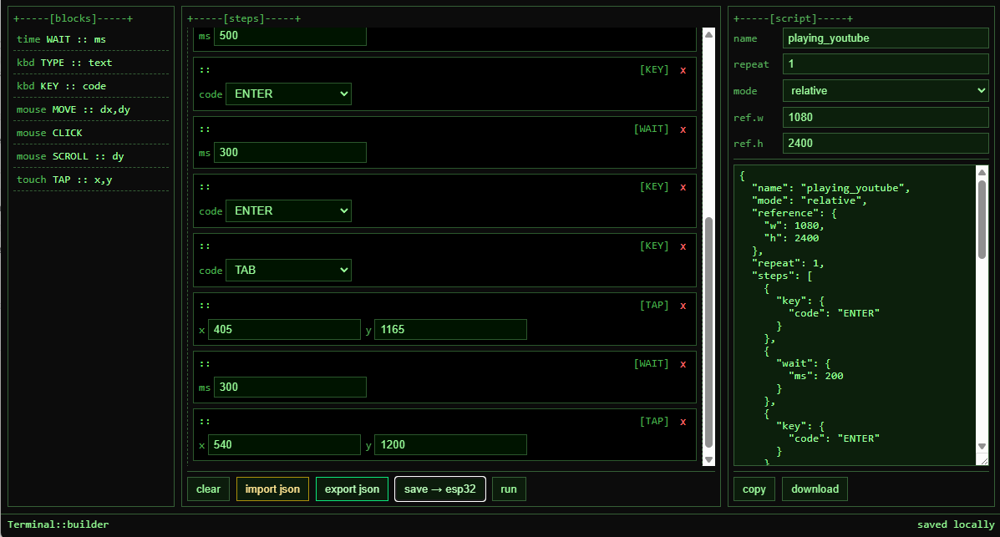

# ESP32 Bluetooth Rubber Ducky

Tiny ESP32 rubber ducky that acts like **Bluetooth keyboard and mouse**, displays status on a **0.91" SSD1306 OLED**, and hosts a **local web panel** where you can visually build, save, and run input scripts (keyboard, mouse, touch actions, etc.).




### Features

- Visual **web panel builder** (drag & drop interface)  
- BLE keyboard and mouse combo via [ESP32-BLE-Combo](https://github.com/blackketter/ESP32-BLE-Combo)  
- Script storage in **LittleFS** (`/script.json`)  
- Single-button trigger for automation  
- **Wi-Fi STA / AP fallback** with built-in web UI  
- 128×32 **SSD1306 OLED (I²C)** display for live status  
- On-screen feedback for Save, Run, and BLE state  

## Hardware

- ESP32-WROOM-32 dev board
- SSD1306 OLED 128×32 0.91" I²C display
- Tact button (6×6xAny)  
- Breadboard / wires (keep SPI wires ≤10 cm to avoid noise)


## How It Works

1. Power on the ESP32; OLED shows `BOOT`.  
2. Device attempts Wi-Fi STA using `WIFI_SSID` and `WIFI_PASS`.  
3. If STA fails, an access point is created:  
   - **SSID:** `TestBot-AP`  
   - **Password:** `esp32test`
4. Open the IP shown on the OLED in your browser.  
5. Build your script visually in the web panel.  
6. Click **Save → ESP32** to store the script in `/script.json`.  
7. Pair the ESP32 as a **Bluetooth keyboard and mouse**.  
8. Press the button to execute the script.

## Pinout

### OLED (I²C) → ESP32

| OLED Pin | Function | ESP32 Pin |
|----------|-----------|-----------|
| VCC | Power | 3v3 |
| GND | Ground | GND |
| SDA | Data | GPIO21 |
| SCL | Clock | GPIO22 |

### Button → ESP32

| Button | Function | ESP32 Pin |
|--------|-----------|-----------|
| BTN | Input | GPIO16 |

> One leg to GPIO, the other to **GND**.  
> The button is active low (`#define BTN_LEVEL LOW`).

## Configuration

### Wi-Fi Credentials

```cpp
#define WIFI_SSID "YourSSID"
#define WIFI_PASS "YourPassword"
```

### Pins

```cpp
#define I2C_SDA 21
#define I2C_SCL 22
#define BTN_PIN 16
#define BTN_LEVEL LOW
```

### Default Script

Defined in `default_script.cpp`:

```json
{
  "name": "hello",
  "mode": "relative",
  "reference": { "w": 1080, "h": 2400 },
  "repeat": 1,
  "steps": [
    { "wait": { "ms": 500 } },
    { "type": { "text": "Hello_from_ESP32" } },
    { "key":  { "code": "ENTER" } }
  ]
}
```

## Usage

1. Power on the ESP32  
2. Connect to the shown **Wi-Fi IP** or to the AP `TestBot-AP`  
3. Open the IP in your browser  
4. Build your steps (type, wait, key, move, etc.)  
5. Save to device — stored at `/script.json`  
6. Pair ESP32 over Bluetooth  
7. Press the button to run the script


## PlatformIO

```ini
[env:esp32dev]
[env:upesy_wroom]
platform = espressif32
board = upesy_wroom
framework = arduino
monitor_speed = 115200
board_build.partitions = min_spiffs.csv
lib_deps = 
	https://github.com/blackketter/ESP32-BLE-Combo.git
	olikraus/U8g2@^2.35.19
	bblanchon/ArduinoJson@^7
```

## Arduino IDE

1. Select **ESP32 Dev Module**  
2. Connect via USB  
3. Ensure **LittleFS** is enabled  
4. Upload and run  


## Project Structure

```
src/
├── main.cpp
├── index.cpp
├── index.h
├── default_script.cpp
└── default_script.h
```

- `index.*` → Web UI HTML (PROGMEM)  
- `default_script.*` → Default JSON script  
- `main.cpp` → Core logic  


## Known quirks / troubleshooting

### Blank OLED
- Check wiring (`SDA=21`, `SCL=22`)  
- Ensure SSD1306 controller  
- Confirm I²C address (default `0x3C`)

### No Bluetooth Input
- Pair device via OS Bluetooth settings  
- Restart ESP32 if BLE connection fails  
- Use ESP32-WROOM-32 (not C3/S3)

### Web Panel Not Loading
- Check serial monitor for IP  
- If STA fails, connect to `TestBot-AP` (`esp32test`)  
- Manually open IP in browser

### Script Not Saving
- Check serial logs for `[FS]` errors  
- Ensure LittleFS is mounted  
- Try reflashing to reset `/script.json`


